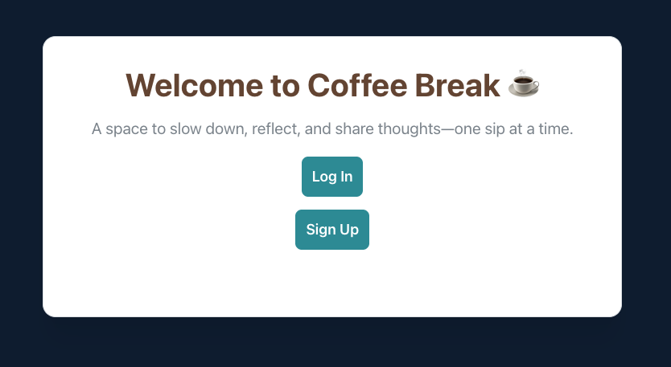
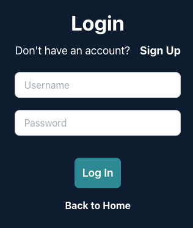
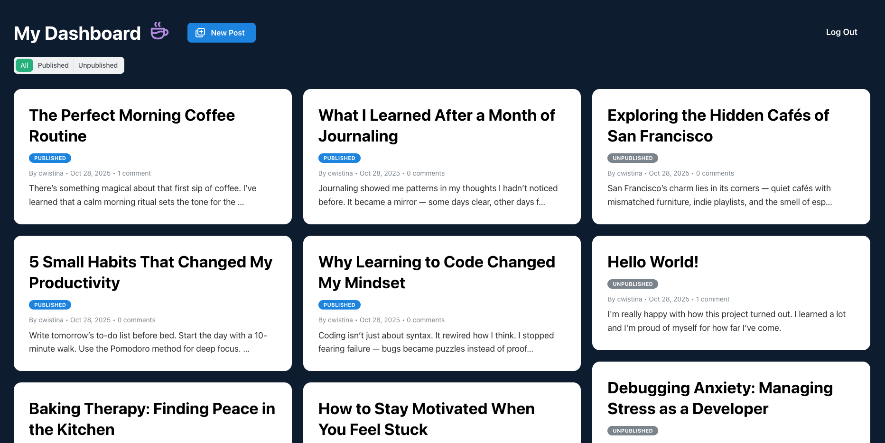
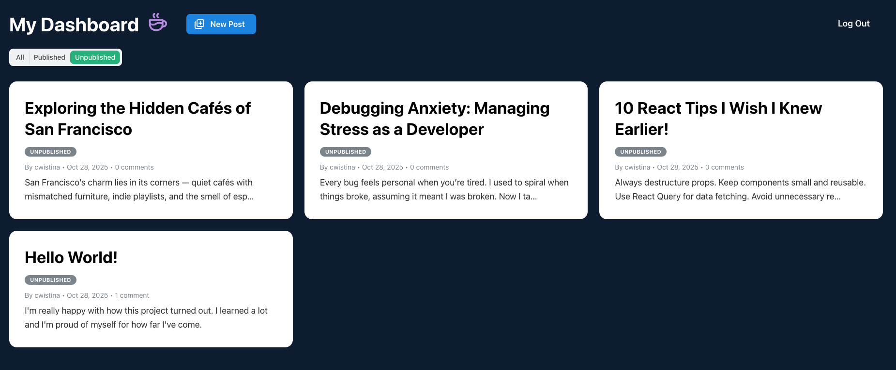
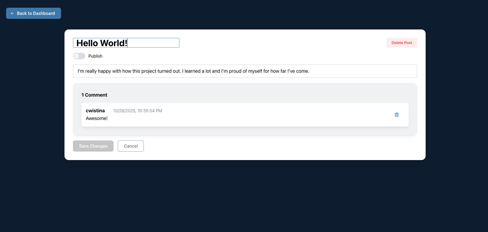
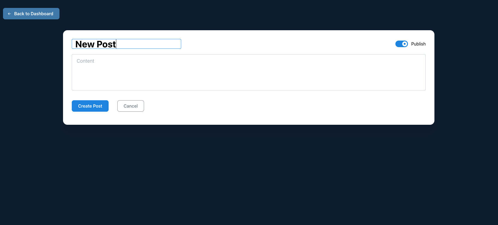

# Coffee Break - Content Management System (CMS)

Author dashboard built with React and Mantine UI for creating, editing, publishing, and managing blog posts securely via JWT-authenticated routes.

Live Demo: [coffee-break-cms.up.railway.app](https://coffee-break-cms.up.railway.app/)

Public Blog: [coffee-break.up.railway.app](https://coffee-break.up.railway.app/)

Blog Client Repo: [github.com/ckim53/blog-client](https://github.com/ckim53/blog-client)

